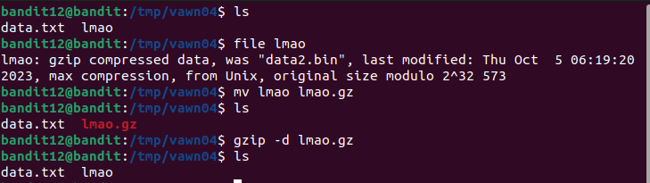
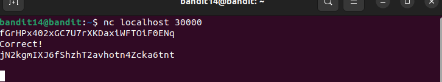

# banditschall


## **Bandit Level 0 → Level 1**

- Sau khi connect vào ta dùng lệnh `ls` , để liệt kê ra các file có trong folder.
- Tìm thấy file có tên readme.
- Dùng lệnh `cat readme` để đọc file, và thấy password:

> 

> Password:  **NH2SXQwcBdpmTEzi3bvBHMM9H66vVXjL**

## **Bandit Level 1 → Level 2**

-Dùng lệnh `ls`, ta thấy file `-`.

-Dùng lệnh `cat ./-` và tìm thấy Password.

> 

> Password:  **rRGizSaX8Mk1RTb1CNQoXTcYZWU6lgzi**


## **Bandit Level 2 → Level 3**

-Dùng lệnh `ls`, ta thấy file có tên `spaces in this file name`.

-Dùng lệnh `cat 'spaces in this file name' ` và tìm thấy Password.

> 

> Password:  **aBZ0W5EmUfAf7kHTQeOwd8bauFJ2lAiG**

## **Bandit Level 3 → Level 4**

-Dùng lệnh `ls`, ta thấy thư mục có tên `inhere`.

-Dùng lệnh `cd inhere` để vào trong thư mục.

-Sau đó dùng lệnh `ls -a`, và thấy file có tên `.hidden`

-Dùng lệnh `cat .hidden' ` và tìm thấy Password.

> 

> Password:  **2EW7BBsr6aMMoJ2HjW067dm8EgX26xNe**

## **Bandit Level 4 → Level 5**

- Dùng lệnh `ls -a`, `cd inhere`.
- Tiếp tục dùng lệnh `ls -a` để xem thì thấy có 9 file, đọc thử 1 file thì thấy lỗi không đọc được.
- Dùng lệnh `file ./*` thì thấy file `-file07` có định dạng ASCII, có thể đọc được.
- `cat ./-file07`
  
> 
  
> Password:  **lrIWWI6bB37kxfiCQZqUdOIYfr6eEeqR**

## **Bandit Level 5 → Level 6**

- Dùng lệnh `ls -a`
- `cd inhere`
- `ls -a` , thấy có rất nhiều folder.
- Dùng lệnh `find -size 1033c` để tìm file theo đề bài. `-size`để lọc file theo size và c là đơn vị của bytes.
- Thấy file`./maybehere07/.file2`, `cat` ra và thấy password
  
> 

> Password:  **P4L4vucdmLnm8I7Vl7jG1ApGSfjYKqJU**

## **Bandit Level 6 → Level 7**

- Theo đề bài ta dùng lệnh `find / -user bandit7 -group bandit6 -size 33c 2>;/dev/null` để tìm những file thuộc quyền của `user bandit7 `, `group6` và `size = 33 bytes` .
- `2>/dev/null` để đưa các file `permission denied` vào `/dev/null`. Ta tìm được file `/var/lib/dpkg/info/bandit7.password`.
- `cat` ra và có được password.
  
> 

> Password: **z7WtoNQU2XfjmMtWA8u5rN4vzqu4v99S**

## **Bandit Level 7 → Level 8**

- Dùng lệnh `ls` , ta thấy file `data.txt` . Theo như đề bài , biết password nằm cạnh cụm từ `millionth`.
- Ta dùng lệnh `grep` để tìm cụm từ `millionth` và tìm ra được password.

> 

> Password: **TESKZC0XvTetK0S9xNwm25STk5iWrBvP**

## **Bandit Level 8 → Level 9**

- Sau khi `ls` và `cat` file ra thì ta thấy trong file có rất nhiều giá trị.
- Và theo như đề bài ta sẽ dùng lệnh `sort data.txt | uniq -u` để tìm ra 1 giá trị không bị trùng và duy nhất.

> 

> Password: **EN632PlfYiZbn3PhVK3XOGSlNInNE00t**

## **Bandit Level 9 → Level 10**

- Đầu tiền , `ls` và thử `cat` file `data.txt` ra thì phát hiện bị lỗi.
- Dùng lệnh `file` để kiểm tra định dạng của file này thì thấy là 1 file data(không thể đọc bằng `cat`).
- Ta dùng `strings` để có thể đọc file và dùng `grep` để tìm dấu `=`, và thấy được password.
  
> 

> Password: **G7w8LIi6J3kTb8A7j9LgrywtEUlyyp6s**

## **Bandit Level 10 → Level 11**

- Sau khi `ls` và `cat` thử file `data.txt` ta thấy một đoạn decode base64.
- Ta dùng lệnh `cat data.txt | base64 --decode` và có được password.

> 

> Password: **6zPeziLdR2RKNdNYFNb6nVCKzphlXHBM**

## **Bandit Level 11 → Level 12**

- Như bài số 11 nhưng ở đây là `ROT13`.
- Ta dùng lệnh sau để có được password: `cat data.txt | tr 'A-Za-z' 'N-ZA-Mn-za-m'`
  
> 

Password: **JVNBBFSmZwKKOP0XbFXOoW8chDz5yVRv**


## **Bandit Level 12 → Level 13**

- Theo đề bài thì ta làm như sau:
- Dùng lệnh `mkdir /tmp/vawn04` để tạo thêm 1 tệp mới.
- `cp data.txt /tmp/vawn04` để `copy` file `data.txt` vào `/tmp/vawn04` và `cd /tmp/vawn04` để vào thư mục.
- Sau đó , dùng lệnh `xxd -r * > lmao` để chuyển `data.txt` và xuất thành file `lmao`.
- Tiếp đến dùng lệnh `file lmao` để kiểm tra định dạng file.
- Biết được đây là dạng `gzip compressed data`.
- Ta dùng lệnh `mv lmao lmao.gz`.
- Sau đó tiến hành giải nén nó ra bằng lệnh `gzip -d lmao.gz`.
- Ta tiếp tục có được file `lmao`.

> 

- Sau nhiều lần kiểm tra và giải nén file qua nhiều định dạng khác nhau.

> 

- Ta có được password sau:

> Password: **wbWdlBxEir4CaE8LaPhauuOo6pwRmrDw**


## **Bandit Level 13 → Level 14**

- Ta dùng `ssh -i sshkey.private bandit14@localhost -p 2220` để ssh vào bandit14
- Sau đó dùng `cat etc/bandit_pass/bandit14` và có được pass

> 

> Password: **fGrHPx402xGC7U7rXKDaxiWFTOiF0ENq**

## **Bandit Level 14 → Level 15**

- Theo đề bài ta `nc localhost 30000`
- Và nhập pass level hiện tại vào và có được pass level tiếp theo.

> 

> Password: **jN2kgmIXJ6fShzhT2avhotn4Zcka6tnt**


## **Bandit Level 15 → Level 16**

- Dùng lệnh `openssl s_client localhost:30001` để kết nối đến server.
- `s_client`: Đây là một chế độ của OpenSSL dùng để thực hiện vai trò của một máy khách SSL/TLS.
- Sau đó nhập pass vào và có được pass level tiếp.

> 

> Password: **JQttfApK4SeyHwDlI9SXGR50qclOAil1**

## **Bandit Level 16 → Level 17**

- Theo đề ta dùng lệnh `nmap -p 31000-32000 localhost` để quét các cổng.
- Kiểm tra đến cổng `31790` ta thấy nó trả lại một đoạn RSA.
- Tiếp theo ta tạo 1 folder mới, sau đó dùng `nano key.private` để tạo một file và paste đoạn RSA đó vào.
- Tiếp đến dùng `chmod 700 key.private` để sửa quyền, rồi connect lại ta có được pass.

> 

> Password: **VwOSWtCA7lRKkTfbr2IDh6awj9RNZM5e**

## **Bandit Level 17 → Level 18**

- Ở bài này ta dùng `diff passwords.old passwords.new` và có được pass.

> 

> Password: **hga5tuuCLF6fFzUpnagiMN8ssu9LFrdg**


## **Bandit Level 18 → Level 19**

- Dùng lệnh `ssh bandit18@bandit.labs.overthewire.org -p 2220 cat readme` để cat file khi connect vào server ta có được pass.

> 

> Password: **awhqfNnAbc1naukrpqDYcF95h7HoMTrC**

## **Bandit Level 19 → Level 20**

 Ở bài này ta sử dụng `setuid` để chạy file.
 `./bandit20-do cat /etc/bandit_pass/bandit20` ta có pass cho level tiếp theo.

> 

> Password: **VxCazJaVykI6W36BkBU0mJTCM8rR95XT**

## **Bandit Level 20 → Level 21**

- Ở đây ta cần tạo một cổng mới ngẫu nhiên.
- `echo "VxCazJaVykI6W36BkBU0mJTCM8rR95XT" | nc -l -p 1810 &`.

> 

> Password: **NvEJF7oVjkddltPSrdKEFOllh9V1IBcq**

## **Bandit Level 21 → Level 22**

- `cd /etc/cron.d/` và kiểm tra thì thấy file `cronjob_bandit22` và `cat` file ra.
- Tiếp tục `cat /usr/bin/cronjob_bandit22.sh`.
- Và `cat /tmp/t7O6lds9S0RqQh9aMcz6ShpAoZKF7fgv` ta có được pass.

> 

> Password: **WdDozAdTM2z9DiFEQ2mGlwngMfj4EZff**

## **Bandit Level 22 → Level 23**

- Gần tương tự bài trên nhưng ở đây ta cần thực thi lệnh `echo I am user bandit23 | md5sum | cut -d ' ' -f 1` để có được pass.

> 

> Password: **8ca319486bfbbc3663ea0fbe81326349**

## **Bandit Level 23 → Level 24**

- Theo để bài ta tạo một folder mới và 1 file script shell.
- Sau đó paste đoạn sao vào:
  
 ```bash
#!/bin/bash

cat /etc/bandit_pass/bandit24 > /tmp/bandit24.txt
```
  
- Tiếp tục làm theo đề bài ta có được pass.

> 

> Password: **VAfGXJ1PBSsPSnvsjI8p759leLZ9GGar**

## **Bandit Level 24 → Level 25**

- Ta tạo một file trong tmp với nội dung như sau:

```bash
#! /bin/bash 

pass=VAfGXJ1PBSsPSnvsjI8p759leLZ9GGar

for i in {0000..9999}
do
        echo "$pass" "$i"
done
```
- Cấp quyền cho nó, sau đó chạy ta có được pass.

> 
> 

> Password: **p7TaowMYrmu23Ol8hiZh9UvD0O9hpx8d**

## **Bandit Level 25 → Level 26**

- Ở bài này ta cần thu nhỏ terminal lại, ssh theo lệnh sau :

```
ssh -i bandit26.sshkey -p 2220 -l bandit26 bandit.labs.overthewire.org
```

- Ấn v để chuyển sang vim sau đó nhập lệnh

```
:set shell =/bin/bash 
:shell
```

- Dùng lệnh cat để đọc flag trong file text.txt

```
cat /etc/bandit_pass/bandit26
```

> 

> Password: **c7GvcKlw9mC7aUQaPx7nwFstuAIBw1o1**

## **Bandit Level 26 → Level 27**

- Tương tự như bài trên.

> 

> Password: **YnQpBuifNMas1hcUFk70ZmqkhUU2EuaS**

## **Bandit Level 27 → Level 28**

- Ta tạo 1 folder ở tmp để clone repo.
- Dùng lệnh `git clone ssh://bandit27-git@localhost:2220/home/bandit27-git/repo` để clone repo.
- `cd repo` , thấy có 1 file README.
- `cat README` , và có pass.

> 

> Password: **AVanL161y9rsbcJIsFHuw35rjaOM19nR**

## **Bandit Level 28 → Level 29**

- Tương tự bài trước ta git clone ra.
- Nhưng mật khẩu ở bài này bị ẩn.
- Nên ta dùng `git log` để xem `commit`
- Dùng `git show` để xem chi tiết.

> 
> 

> Password: **tQKvmcwNYcFS6vmPHIUSI3ShmsrQZK8S**

## **Bandit Level 29 → Level 30**

- Tương tự bài trước.
- Sau khi kiểm tra mà không thấy gì, ta dùng `git checkout dev` để chuyển branch `origin` sang `dev`.
- Tiếp tục kiểm tra và tìm được pass.
  
> 

> Password: **xbhV3HpNGlTIdnjUrdAlPzc2L6y9EOnS**

## **Bandit Level 30 → Level 31**

- Vẫn tương tự như bài trên.
- Nhưng ở đây ta dùng `git tag` để xem nhãn repo này.

> 

> Password: **OoffzGDlzhAlerFJ2cAiz1D41JW1Mhmt**


## **Bandit Level 31 → Level 32**

- Với bài này ta dung `git push`.

> 

> Password: **rmCBvG56y58BXzv98yZGdO7ATVL5dW8y**


## **Bandit Level 32 → Level 33**

- Ở bài này ta sử dụng $0 vì $0 biểu diễn cho một shell hay bắt đầu của một shell.

> 

> Password: **odHo63fHiFqcWWJG9rLiLDtPm45KzUKy**

## **THE END!!**

¯⁠\⁠_⁠(⁠ツ⁠)⁠_⁠/⁠¯

> 
