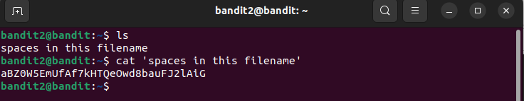
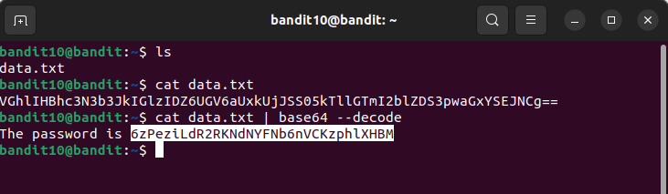

# banditschall

## **Bandit Level 0 → Level 1**

- Sau khi connect vào ta dùng lệnh `ls` , để liệt kê ra các file có trong folder.
- Tìm thấy file có tên readme.
- Dùng lệnh `cat readme` để đọc file, và thấy password:

> 

> Password:  **NH2SXQwcBdpmTEzi3bvBHMM9H66vVXjL**

## **Bandit Level 1 → Level 2**

-Dùng lệnh `ls`, ta thấy file `-`.

-Dùng lệnh `cat ./-` và tìm thấy Password.

> 

> Password:  **rRGizSaX8Mk1RTb1CNQoXTcYZWU6lgzi**

## **Bandit Level 2 → Level 3**

-Dùng lệnh `ls`, ta thấy file có tên `spaces in this file name`.

-Dùng lệnh `cat 'spaces in this file name' ` và tìm thấy Password.

> 

> Password:  **aBZ0W5EmUfAf7kHTQeOwd8bauFJ2lAiG**

## **Bandit Level 3 → Level 4**

-Dùng lệnh `ls`, ta thấy thư mục có tên `inhere`.

-Dùng lệnh `cd inhere` để vào trong thư mục.

-Sau đó dùng lệnh `ls -a`, và thấy file có tên `.hidden`

-Dùng lệnh `cat .hidden' ` và tìm thấy Password.

> 

> Password:  **2EW7BBsr6aMMoJ2HjW067dm8EgX26xNe**

## **Bandit Level 4 → Level 5**

- Dùng lệnh `ls -a`, `cd inhere`.
- Tiếp tục dùng lệnh `ls -a` để xem thì thấy có 9 file, đọc thử 1 file thì thấy lỗi không đọc được.
- Dùng lệnh `file ./*` thì thấy file `-file07` có định dạng ASCII, có thể đọc được.
- `cat ./-file07`
  
> 
  
> Password:  **lrIWWI6bB37kxfiCQZqUdOIYfr6eEeqR**

## **Bandit Level 5 → Level 6**

- Dùng lệnh `ls -a`
- `cd inhere`
- `ls -a` , thấy có rất nhiều folder.
- Dùng lệnh `find -size 1033c` để tìm file theo đề bài. `-size`để lọc file theo size và c là đơn vị của bytes.
- Thấy file`./maybehere07/.file2`, `cat` ra và thấy password
  
> 

> Password:  **P4L4vucdmLnm8I7Vl7jG1ApGSfjYKqJU**

## **Bandit Level 6 → Level 7**

- Theo đề bài ta dùng lệnh `find / -user bandit7 -group bandit6 -size 33c 2>;/dev/null` để tìm những file thuộc quyền của `user bandit7 `, `group6` và `size = 33 bytes` .
- `2>/dev/null` để đưa các file `permission denied` vào `/dev/null`. Ta tìm được file `/var/lib/dpkg/info/bandit7.password`.
- `cat` ra và có được password.
  
> 

> Password: **z7WtoNQU2XfjmMtWA8u5rN4vzqu4v99S**

## **Bandit Level 7 → Level 8**

- Dùng lệnh `ls` , ta thấy file `data.txt` . Theo như đề bài , biết password nằm cạnh cụm từ `millionth`.
- Ta dùng lệnh `grep` để tìm cụm từ `millionth` và tìm ra được password.

> 

> Password: **TESKZC0XvTetK0S9xNwm25STk5iWrBvP**

## **Bandit Level 8 → Level 9**

- Sau khi `ls` và `cat` file ra thì ta thấy trong file có rất nhiều giá trị.
- Và theo như đề bài ta sẽ dùng lệnh `sort data.txt | uniq -u` để tìm ra 1 giá trị không bị trùng và duy nhất.

> 

> Password: **EN632PlfYiZbn3PhVK3XOGSlNInNE00t**

## **Bandit Level 9 → Level 10**

- Đầu tiền , `ls` và thử `cat` file `data.txt` ra thì phát hiện bị lỗi.
- Dùng lệnh `file` để kiểm tra định dạng của file này thì thấy là 1 file data(không thể đọc bằng `cat`).
- Ta dùng `strings` để có thể đọc file và dùng `grep` để tìm dấu `=`, và thấy được password.
  
> 

> Password: **G7w8LIi6J3kTb8A7j9LgrywtEUlyyp6s**

## **Bandit Level 10 → Level 11**

- Sau khi `ls` và `cat` thử file `data.txt` ta thấy một đoạn decode base64.
- Ta dùng lệnh `cat data.txt | base64 --decode` và có được password.

> 

> Password: **6zPeziLdR2RKNdNYFNb6nVCKzphlXHBM**

## **Bandit Level 11 → Level 12**

- Như bài số 11 nhưng ở đây là `ROT13`.
- Ta dùng lệnh sau để có được password: `cat data.txt | tr 'A-Za-z' 'N-ZA-Mn-za-m'`
  
> 

Password: **JVNBBFSmZwKKOP0XbFXOoW8chDz5yVRv**

## **Bandit Level 12 → Level 13**

- Theo đề bài thì ta làm như sau:
- Dùng lệnh `mkdir /tmp/vawn04` để tạo thêm 1 tệp mới.
- `cp data.txt /tmp/vawn04` để `copy` file `data.txt` vào `/tmp/vawn04` và `cd /tmp/vawn04` để vào thư mục.
- Sau đó , dùng lệnh `xxd -r * > lmao` để chuyển `data.txt` và xuất thành file `lmao`.
- Tiếp đến dùng lệnh `file lmao` để kiểm tra định dạng file.
- Biết được đây là dạng `gzip compressed data`.
- Ta dùng lệnh `mv lmao lmao.gz`.
- Sau đó tiến hành giải nén nó ra bằng lệnh `gzip -d lmao.gz`.
- Ta tiếp tục có được file `lmao`.

> 

- Sau nhiều lần kiểm tra và giải nén file qua nhiều định dạng khác nhau.

> 

- Ta có được password sau:

> Password: **wbWdlBxEir4CaE8LaPhauuOo6pwRmrDw**
